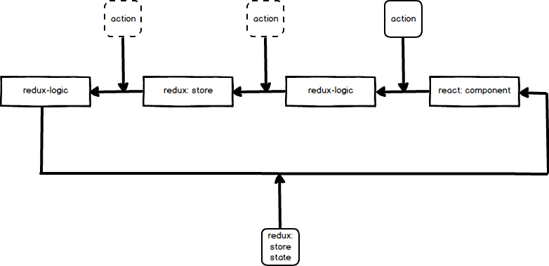

# Архитектура

База архитектуры строится на четырех библиотеках: 
[react](https://facebook.github.io/react/), 
[redux](http://redux.js.org/), 
[redux-logic](https://github.com/jeffbski/redux-logic)
[redux-form](http://redux-form.com/6.5.0/)

## React

Отвечает за ui часть приложения, отрисовку в браузере.

## Redux

Отвечает за хранение данных и предоставление этих данных в React компоненты.

## Redux-Logic

Является middleware.
Отвечает за выполнение ajax - запросов на основе данных из store и данных, 
формируемыми action'ами

## Redux-Form

Работа с формами: валидация, применение и связка с redux.store

## Как работает

Взаимодействие между этими библиотеками строится на action'ах. Логики могут
action'ы прерывать, запускать свои доп. action'ы и т.д. Store пишет в себя
данные, которые передаются в action'ах. Если компонент react подключен к store,
то он на вход принимает данные из store, после того как обработан action.

